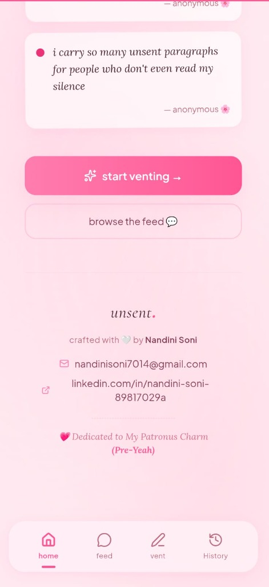
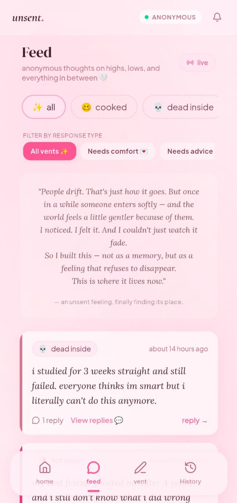
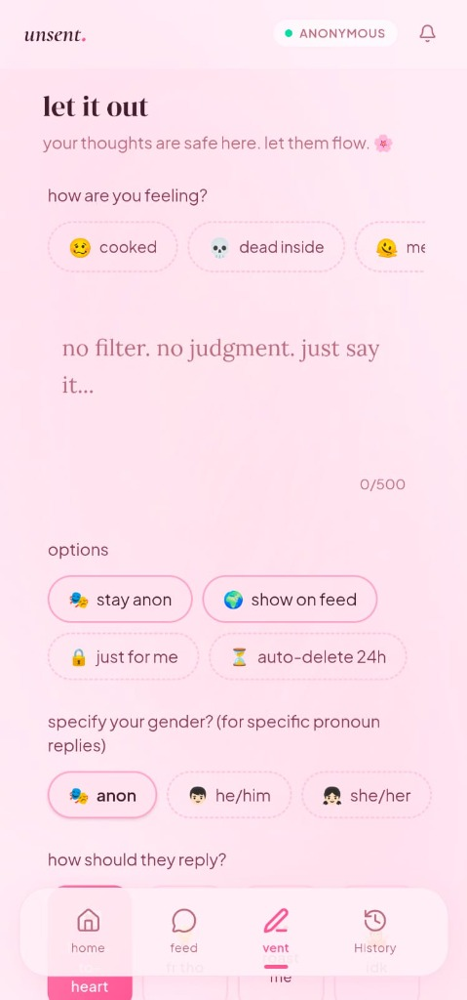

# 🌸 unsent. — *say it. someone hears it.*

[](#)
[](#)
[](#)

A beautiful, delicate, and high-aesthetic anonymous space where young minds can share their deepest thoughts, highs, lows, and everything in between. Post a vent, get empathetic replies from absolute strangers (or compassionate AI), view dynamic public conversation threads, recover your diary across devices, or delete your entries at any time.

Built with a stunning **baby pink glassmorphism design system**, fluid spring-loaded animations, and stateless context processors.

---

## 📸 App Preview

<p align="center">
  
  
  
</p>

---

## ✨ Features

### 1. 🔒 100% Anonymous-First Venting
- No forced logins, no email verification walls. Launch the app and express yourself immediately.
- Secure, stateless, and unique client `deviceId` generation stored entirely in localStorage.
- Auto-generation of cute default avatars and secure, deterministic stranger nicknames.

### ✍️ 2. Premium Venting Suite
- **Mood Selector**: Curated, beautifully colored tags like `cooked 🥴`, `dead inside 💀`, `melting 🫠`, and `not okay 🥀`.
- **Anonymity Options**: Choose to publish globally to the feed (`show on feed`), keep it private (`just for me`), or schedule automatic self-destruction (`auto-delete 24h`).
- **Gender Selection**: Specify gender context (`anon`, `he/him`, `she/her`) to dynamically tailor AI reply pronouns.
- **Reply Style Picker**: Request specific feedback types (`heart-to-heart 🫂`, `fr tho 💡`, `roast me 💀`, or `idk`).

### 💬 3. Nested Public Reply Threads
- View complete reply threads directly on feed cards.
- **Deterministic Hashed Nicknames**: Unique stranger hashes (e.g. `stranger #4829`) derived deterministically from their secure client ID, allowing readers to track conversational threads anonymously.
- Pulsing loading animations and live interactive database fetches.

### 🔮 4. Background Async AI replies & Toasts
- Write a vent, click send, and immediately click **"Go back to Home 🌸"** to browse or do whatever you want! AI reply generation runs fully decoupled in the background.
- **3-Second Auto-Dismiss Toasts**: Glassmorphic notifications slide down beautifully when a reply completes, auto-dismissing after 3 seconds to keep your screen clean.
- **Bell alerts Modal**: Unread notification counts persist dynamically on the Bell icon, opening a private, local alerts tray. Tapping an alert fetches the parent vent dynamically and opens the thread.

### 💫 5. Cloud-Synced Diary Account Recovery
- Create an optional credentials login (Email + Password) to sync and back up your diary.
- **Zero-Friction Registration**: Type an email; if it doesn't exist, the system registers you on-the-fly.
- **Offline Diary Linking**: When you log in, all offline anonymous vents previously composed on that device instantly associate with your new account in Supabase, keeping your history preserved.

### 🗑️ 6. Unlimited Vent Deletions
- Complete control over your diary. Authoring devices can delete any of their vents at **any time** directly from the History tab.
- Click confirm on the pop-up alert to cleanly cascade and purge the vent, all replies, and reactions from the Supabase database and client localStorage cache.

---

## 🛠️ Technology Stack

- **Framework**: [Next.js 16](https://nextjs.org/) (App Router, Turbopack, Fast SSR compilation)
- **Styling**: Vanilla CSS (Tailwind CSS v4 tokens, responsive layouts, glassmorphism filters, customized SVG patterns)
- **State Management**: [Zustand](https://github.com/pmndrs/zustand) (stateless workers, alerts controller, auth store)
- **Database**: [Supabase PostgreSQL](https://supabase.com/) (dynamic joins `select('*, replies(count)')`, RLS controls, automated pruning)
- **AI Core**: [Google AI Studio (Gemini 2.0 Flash)](https://aistudio.google.com/) (Wise Hinglish/English grammar rules, no Superhero clichés, masculine/feminine suffix overrides)

---

## 🚀 Setup & Installation

### 1. Clone & Install Dependencies
```bash
git clone https://github.com/NANDINI-7777/Unsent.git
cd Unsent
npm install
```

### 2. Configure Environment Variables (`.env.local`)
Create a `.env.local` file in the root of your project and configure the following keys:
```env
# Google AI Studio API Key for Empathy Replies
GOOGLE_AI_API_KEY=your_gemini_api_key_here

# Supabase Cloud Database Keys
NEXT_PUBLIC_SUPABASE_URL=https://your-project-id.supabase.co
NEXT_PUBLIC_SUPABASE_ANON_KEY=your-anon-public-key
```

### 3. Initialize Database SQL Schema
Open your **Supabase Dashboard → SQL Editor**, paste the following SQL, and click **Run** to set up tables, references, and automatic relations:

```sql
-- 1. Vents Table
CREATE TABLE vents (
  id           UUID PRIMARY KEY DEFAULT gen_random_uuid(),
  content      TEXT NOT NULL CHECK (char_length(content) <= 500),
  mood         TEXT NOT NULL,
  mood_emoji   TEXT DEFAULT '🌸',
  mood_color   TEXT DEFAULT '#f56393',
  reply_style  TEXT DEFAULT 'hug',
  show_on_feed BOOLEAN DEFAULT true,
  auto_delete  BOOLEAN DEFAULT false,
  device_id    TEXT NOT NULL,
  reply_count  INT DEFAULT 0,
  gender       TEXT DEFAULT 'anon',
  user_id      UUID,
  created_at   TIMESTAMPTZ DEFAULT NOW(),
  expires_at   TIMESTAMPTZ
);

-- 2. Replies Table
CREATE TABLE replies (
  id           UUID PRIMARY KEY DEFAULT gen_random_uuid(),
  vent_id      UUID REFERENCES vents(id) ON DELETE CASCADE,
  content      TEXT NOT NULL CHECK (char_length(content) <= 1000),
  device_id    TEXT, -- NULL for AI replies
  created_at   TIMESTAMPTZ DEFAULT NOW()
);

-- 3. Reactions Table
CREATE TABLE reactions (
  id           UUID PRIMARY KEY DEFAULT gen_random_uuid(),
  reply_id     UUID REFERENCES replies(id) ON DELETE CASCADE,
  reaction     TEXT NOT NULL,
  own_comment  TEXT CHECK (char_length(own_comment) <= 200),
  device_id    TEXT NOT NULL,
  created_at   TIMESTAMPTZ DEFAULT NOW()
);
```

### 4. Run Development Server
```bash
npm run dev
```
Open **[http://localhost:3000](http://localhost:3000)** in Chrome and enjoy the beautiful experience!

---

## 🎨 Creative Poem Dedication (Feed Header)
Sitting peacefully right above the feed:

> *"People drift. That's just how it goes. But once in a while someone enters softly – and the world feels a little gentler because of them. I noticed. I felt it. And I couldn't just watch it fade.*
> *So I built this – not as a memory, but as a feeling that refuses to disappear. This is where it lives now."*
>
> *— an unsent feeling, finally finding its place.*

---

## 💌 Developer Contact & Dedication
* **Crafted with 🤍 by Nandini Soni**
* 📧 Email: [nandinisoni7014@gmail.com](mailto:nandinisoni7014@gmail.com)
* 💼 LinkedIn: [linkedin.com/in/nandini-soni-89817029a](https://linkedin.com/in/nandini-soni-89817029a)
* 💖 Dedicated to My Patronus Charm (`Pre-Yeah`)
